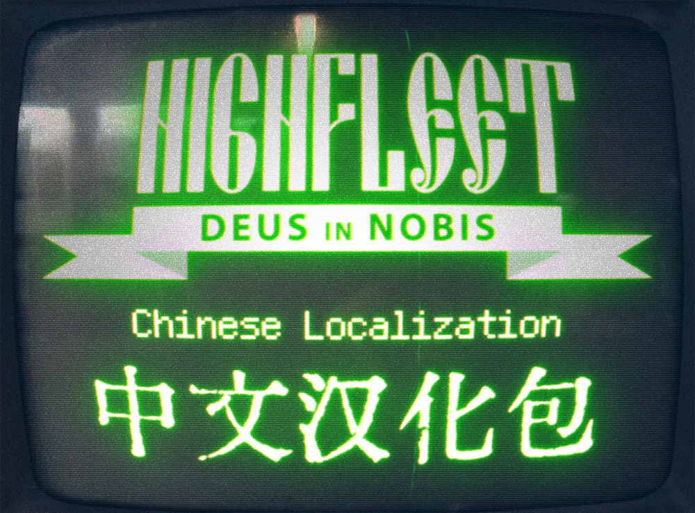
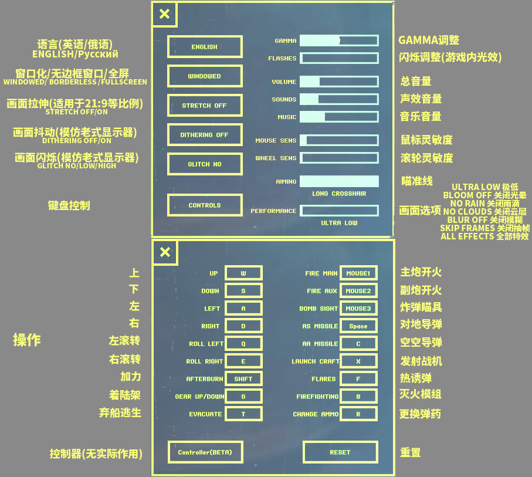
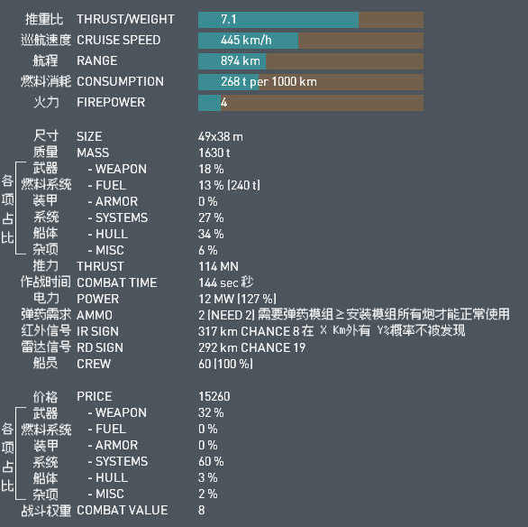

# 关于本地化项目

汉化补丁的详细介绍可参考[Github项目](https://github.com/Xchiliarch/Highfleet-Chinese-localization)。

汉化的原理可参阅此[Github项目](https://github.com/Xchiliarch/Highfleet_chinese_work)。

## 简介

本汉化补丁基于游戏内贴图调用进行汉化，目前仍然具有部分无法汉化的部分：

1.船只部件介绍

2.电报（已做拼音式汉化 如 Su4 Du4 即为速度的拼音）

3.地图地名（无需理解）

4.弹药、标示等

5.船坞内数据、设置（下有对照图）

上述部分词汇较为固定，一次查阅即可理解，可自行参考翻译。

## 汉化贡献者

stopnoanime(who laid the foundation of the project),

Homobanana(main contributor of text translations),

Iansniper(proofreader of the project),

Xchiliarch(maintainer of the project),

Commie-Spy,Rogo921,BI-XY,Eistin-Yite,OpaqueArc,KagaJiankui,

Suesun-1132,xlmzg,LeberechtSchorner

and many friends pointing out the bugs and improved the performance.

# Highfleet设置及船坞翻译对照

## 建议

1.最好不要调整controller内设置（游戏尚未实现）

2.瞄准线请拉到最长以方便瞄准，使用长准星mod随意（安装后所有档位均有）

3.画面选项可自行调整寻找合适设置（闪烁在作战时会影响视野，开启云层及雨滴战斗会更难感知态势）

4.画面闪烁及闪烁可适当调低（游戏内光效繁杂，高光效费眼且不益于辨识）

## 注意

游戏的窗口化实际上为一个1080p的窗口，故屏幕为1080p的显示器，窗口化实际上并不会有任何改变（毛子特色）

**使用汉化补丁请确认语言在ENGLISH档，若进游戏为俄语，点击田字方框的左上方框进入下图设置调整为英语**

