# 如何自制Highfleet舰船部件

厌倦了堆砌大量武器库、发电机只为了让巡空舰使用上更多的大炮？还在为舰船的油耗和孱弱的推重比烦恼？

为什么不试试自己制作一个部件，让你在游戏内更加合理的安排布局呢？下面就带你一步步完成一个部件的修改。


## 理解文件含义

OL.seria: 功能性部件注册的文件，功能性部件都会在这里进行注册，包含了该部件唯一的Oid（如身份证号）以及部件的属性等（如引擎的推力，舰炮的射速等），我们自制的部件也会在这里添加上注册信息。

Parts.seria:部件信息，包括了船舱的Mesh信息，详细的部件信息将从这里获得。

Constructor.seria: 包含了所有船坞内可用部件的信息，只有在此处注册的部件才能在船坞内使用。我们需要将部件信息导入此处，才能在船坞内看到你修改的部件！


## 步骤

### 1.OL.seria内添加自制部件（以添加一个自制引擎为例）

1. 打开OL.seria，我们选择小型全向引擎NK-25作为引擎的母本，即修改的引擎外观即大小和NK-25一样，但是其数值由我们自由填写。（你也可以完全新建一个引擎，从外观贴图到它的mesh结构，但是这需要更多的知识以完成）

   一个部件的注册信息包含于一个代码块内。形如下图。

```
m_stats=2051
{
#部件信息
}
```

  我们搜索`m_oid=MDL_ENGINE_04`，即NK-25在游戏内的oid，即可获得NK-25引擎的注册信息如下。


```
m_stats=2051
{
m_classname=Stats
m_code=2051
m_oid=MDL_ENGINE_04
m_price=1500
m_important=true
m_repair_cost=24

m_icon_name=MDL_ENGINE_04
m_category=256
m_sort_index=300
m_burn_ignite=400
m_burn_heat=10
m_mdl_armor=5
m_mdl_fuel_need=6.25
m_mdl_crew_need=4
m_mdl_power_need=1300
m_mdl_thrust=3.6e+07
m_mdl_thrust_map=1.8e+07
m_mdl_at=1e+07
m_signature_ir=6.25
m_fxpos.y=6.7
}
```


2. 我们引擎的信息复制下来粘贴在原版引擎下方。并修改m_oid为不同于原版部件的名字（对于游戏的引擎，MDL_ENGINE_01到MDL_ENGINE_05均有对应，请不要占用）。

   为了不与原版冲突，我们选择将它命名为MDL_ENGINE_TEST。同时修改引擎的数据如下。

   一个部件的各项数据所代表的含义可在附录查看，在此就不啰嗦了。如下即为修改后的信息（本教程仅修改引擎的价格，改为1元）。  

   ```
   m_stats=2051
      {
      m_classname=Stats
      m_code=2051
      m_oid=MDL_ENGINE_TEST	#修改的内容
      m_price=1				#修改的内容
      m_important=true
      m_repair_cost=24
      m_icon_name=MDL_ENGINE_04
      m_category=256
      m_sort_index=300
      m_burn_ignite=400
      m_burn_heat=10
      m_mdl_armor=5
      m_mdl_fuel_need=6.25
      m_mdl_crew_need=4
      m_mdl_power_need=1300
      m_mdl_thrust=3.6e+07
      m_mdl_thrust_map=1.8e+07
      m_mdl_at=1e+07
      m_signature_ir=6.25
      m_fxpos.y=6.7
      }
   ```

   此步完成后在OL.seria的工作便完成了。

   ### 2.Parts.seria 获取部件详细信息

3. 在OL.seria操作完成后，打开Parts.seria。搜索我们所修改的引擎的原版，即m_oid=MDL_ENGINE_04。一个部件的全部信息都包含于下图所示代码块内。

   我们只需要找到并复制该代码块，准备用于粘贴到Constructor.seria，即可完成本步。

   ```
   m_children=15
   {
   #部件信息
   )
   ```

   对于MDL_ENGINE_04,这部分代码如下

   ```
   m_children=15
   {
   m_classname=Body
   m_code=15
   m_id=2260846040761029094
   m_name=ENGINE
   m_state=2
   m_master_id=-3584668862680703659
   m_position.x=-349.643
   m_position.y=-3.92857
   m_center.x=-0.114485
   m_center.y=1.5717
   m_stage=6
   m_density=100
   m_mass=30076.3
   m_mesh=1073741827
   {
   m_classname=Mesh
   m_size=6
   2.88532
   -3.21374
   2.88532
   1.99946
   1.88554
   6.42858
   -1.97161
   6.42858
   -3.11429
   2.64287
   -1.8996
   -3.28518
   }
   m_layer=4
   m_slot_type=146
   m_logic=200
   m_logic_active=true
   m_logic_editor=2100
   m_oid=MDL_ENGINE_04
   m_count=999
   is_loot=true
   m_burn_hp=10
   m_ed_rotate=0
   m_sprites=536870915
   {
   m_classname=Sprite
   m_code=536870915
   m_animation_name=thrust_ferma_02
   m_mask=0
   m_slot_constrain=0
   }
   m_sprites=536870915
   {
   m_classname=Sprite
   m_code=536870915
   m_animation_name=thrust_engine_04
   m_stage=1
   m_mask=0
   }
   m_sprites=536870915
   {
   m_classname=Sprite
   m_code=536870915
   m_animation_name=thrust_shield_02
   m_stage=2
   m_mask=0
   m_slot_constrain=0
   }
   m_slots=2147483651
   {
   m_classname=Slot
   m_code=2147483651
   m_master.id=2260846040761029094
   m_type=146
   is_master=false
   }
   m_spasmcode=1
   m_spasmcode=3
   m_spasmcode=100
   m_spasmcode=102
   }
   ```

### 修改部件信息，将部件导入Constructor.seria

4.打开Constructor.seria，对于一个部件，他在船坞内调用的位置与Parts类似。

```
m_children=15
{
#信息
}
```

我们来到文件末尾，可以发现如下图所示的部件信息。

```
m_children=15
{
m_classname=Body
m_code=15
m_id=-4205718291365127845
m_state=2
m_master_id=7949614037389991369
m_position.x=-100.857
m_position.y=79.8571
m_stage=18
m_density=0
m_mesh=1073741827
{
m_classname=Mesh
m_size=4
-2.28537
2.28537
-2.28537
-2.28537
2.28537
-2.28537
2.28537
2.28537
}
m_layer=0
m_health=1e+10
m_health_max=1e+10
m_oid=ITEM_EMERGENCY
m_count=999
is_loot=true
m_sprites=536870915
{
m_classname=Sprite
m_code=536870915
m_animation_name=black
m_mask=0
}
}	#此为部件的结束大括号

}	#此大括号与文件开头匹配
```

**注意，文件末尾有三个连续的右大括号，最后一个大括号是与文件开头的大括号匹配的，部件的代码仅有两个大括号。再后面替换时注意只框选两个！！**

这部分这代表应急系统所对应的部件在船坞内的注册位置。


我们要做的就是将自制的部件替换掉应急系统在船坞内的位置，这样就能在造船的时候使用这个部件了。


5.我们记录下应急系统的m_id和m_master_id。

```
m_id=-4205718291365127845
m_master_id=7949614037389991369
```

以我们自制部件的信息替换掉这一部分。将m_id和m_master_id修改为上面记录的应急系统的m_id和m_master_id。同时，将m_oid替换为我们自制引擎的oid,即MDL_ENGINE_TEST。在完成后，你的文件最后一个部件应该如下所示，**同时在文件末尾还有一个右大括号，在此处未展示**。

```
m_children=15
{
m_classname=Body
m_code=15
m_id=-4205718291365127845	#替换
m_name=ENGINE
m_state=2
m_master_id=7949614037389991369	#替换
m_position.x=-349.643
m_position.y=-3.92857
m_center.x=-0.114485
m_center.y=1.5717
m_stage=6
m_density=100
m_mass=30076.3
m_mesh=1073741827
{
m_classname=Mesh
m_size=6
2.88532
-3.21374
2.88532
1.99946
1.88554
6.42858
-1.97161
6.42858
-3.11429
2.64287
-1.8996
-3.28518
}
m_layer=4
m_slot_type=146
m_logic=200
m_logic_active=true
m_logic_editor=2100
m_oid=MDL_ENGINE_TEST	#替换
m_count=999
is_loot=true
m_burn_hp=10
m_ed_rotate=0
m_sprites=536870915
{
m_classname=Sprite
m_code=536870915
m_animation_name=thrust_ferma_02
m_mask=0
m_slot_constrain=0
}
m_sprites=536870915
{
m_classname=Sprite
m_code=536870915
m_animation_name=thrust_engine_04
m_stage=1
m_mask=0
}
m_sprites=536870915
{
m_classname=Sprite
m_code=536870915
m_animation_name=thrust_shield_02
m_stage=2
m_mask=0
m_slot_constrain=0
}
m_slots=2147483651
{
m_classname=Slot
m_code=2147483651
m_master.id=2260846040761029094
m_type=146
is_master=false
}
m_spasmcode=1
m_spasmcode=3
m_spasmcode=100
m_spasmcode=102
}
```

那么此时，你已经完成了所有工作，打开游戏进入船坞，你应该就可以看到如下图所示。

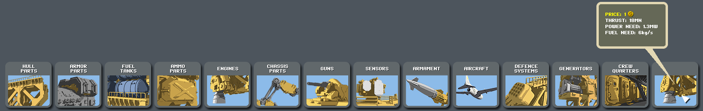

恭喜你，你已经成功完成了一个自制引擎的工作！它可以作为你自制舰船的一部分了。


## 常见问题

#### 进入船坞时卡死、船坞内无部件

Constructor.seria内：

文件末尾是否误删了与文件头匹配的右大括号？`在修改前，Constructor.seria末尾应有3个连续的右大括号，你修改时应该删除两个，是否多删除了一个大括号？`

修改的部件是否具有原应急系统的m_id和m_master_id？

#### 部件没有修改成功，依然是修改部件的原部件参数

OL.seria内：

你修改的部件是否具有不同于原装部件的m_oid？

Constructor.seria内：

修改的部件是否具有OL.seria内设定的新m_oid？

#### 修改部件并未出现在船坞内

Constructor.seria内：

修改的部件是否具有原应急系统的m_id和m_master_id？

部分部件修改后并不位于最右边，可能在中间位置，注意查看。


## 附录

[引擎](#id11)        [防御系统](#id28)

[弹药库](#id15)    [信息系统](#id31)

[发电机](#id17)    [着陆架](#id43)

[宿舍](#id19)        [火炮](#id45)

[油箱](#id21)        [导弹](#id47)

[舰载机](#id23)    [装甲](#id49)

[结构件](#id53)    [应急系统](#id25) 

[其它参数](#id58)


### 部分通用参数：

`m_price=200`			  价格

`m_important=true`	重要性（无该类部件无法保存为舰船）

`m_repair_cost=24`	维修价格，与时间有关 

`m_mdl_armor=5`		  装甲

`m_mdl_crew_need=4` 	舰员需求

`m_mdl_power_need=200`	电力需求

`m_mdl_sectors_type=4`	发射扇区的类型（见下）

`m_mdl_sectors_threshold=0.5`  发射扇区起点

`m_mdl_power_priority=1`  供电优先级

------

### 火炮武器口径参数

m_weapon_caliber项参数：

| 参数 |      口径       |
| :--: | :-------------: |
|  5   |      37mm       |
|  10  |      57mm       |
|  15  |      100mm      |
|  20  |      130mm      |
|  25  |      180mm      |
|  52  |   220mm火箭弹   |
|  30  |   增强型180mm   |
|  40  | 究极增强性180mm |
|  51  |     火箭弹      |
|  54  |    300mm鱼雷    |
|  55  |     火箭弹      |
|  90  |     鱼叉炮      |

------

### 发射扇区类型：

m_mdl_sectors_type

| 参数 |             扇区             |
| :--: | :--------------------------: |
|  1   |       全向（用于火炮）       |
|  2   |    左右扇区（用于雷达等）    |
|  3   | 定向扇区（干扰弹、逃生舱等） |
|  4   |      下扇区（定向引擎）      |

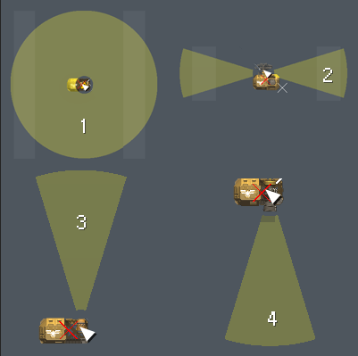

------

### 引擎

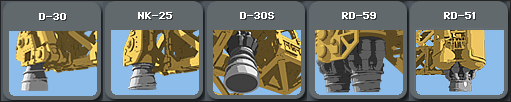

#### 全向引擎

**「大」RD-59**:	`m_oid=MDL_ENGINE_01`

**「小」D-30**:     `m_oid=MDL_ENGINE_03`

**「小」NK-25**:	`m_oid=MDL_ENGINE_04`

#### 固定引擎

**「大」RD-51**:	`m_oid=MDL_ENGINE_02`

**「小」D-30S**:	`m_oid=MDL_ENGINE_01`

#### 引擎参数

`m_mdl_fuel_need=4`	燃油消耗

`m_mdl_thrust=3.2e+07` 	战斗时的推力，计算推重比

`m_mdl_thrust_map=2.1e+07`	战役地图的推力，计算航速

`m_mdl_at=1.5e+07`	战斗时的推力加速度，计算过载黑屏

`m_signature_ir=6`	产生的红外信号

------

### 弹药库

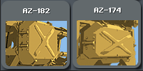

**「大」AZ-182**:	`m_oid=MDL_AMMO`

**「小」AZ-174**:	`m_oid=MDL_AMMO_02`

#### 弹药库参数

`m_mdl_ammobox=2`	弹药箱容量

------

### 发电机

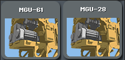

**「大」MGU-61**:	`m_oid=MDL_GENERATOR_01`

**「小」MGU-28**:    `m_oid=MDL_GENERATOR_02`

#### 发电机参数

`m_mdl_power=600000`	发电功率，单位为KW ，2800即为2.8MW

------

### 宿舍


**「大」Large Quarters**: `m_oid=MDL_QUARTERS_01`

**「小」Small Quarters**: `m_oid=MDL_QUARTERS_02`

#### 宿舍参数

`m_mdl_crew_capacity=5000`	舱室容纳人数

------

### 油箱

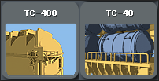

**「大」TC-400**: `m_oid=MDL_FUEL_02`

**「小」TC-40**: `m_oid=MDL_FUEL_01`

#### 油箱参数

`m_burn_hp_max=100` 耐燃值，考验灭火手速

`m_burn_ignite=200` 燃点

`m_burn_heat=200`  爆炸产热

`m_mdl_fuel_capacity=4e+06`燃油容量,单位千克

------

### 舰载机


**「亚音速轰炸机」LA-29**:`m_oid=CRAFT_LA29`

**「超音速轰炸机」T-7**:	 `m_oid=CRAFT_T7`

**MB-110(游戏内未实装)**:	`m_oid=CRAFT_MB110` 

#### 舰载机参数

`m_mdl_ammobox_need=1`  所需弹药箱数量

`m_launched_speed=350`飞行速度，单位m/s

`m_launched_range=4000` 作战航程，单位km

`m_weapon_load_amount=30` 武器装填数量，修改效果存疑

`m_weapon_load_time=10` 武器装填时间，修改效果存疑

`m_weapon_rate=2000`	武器射速，修改效果存疑

------

### 应急系统

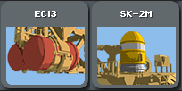

**「火灾抑制模组」 EC-13**: `m_oid=MDL_FSS_02`

**「逃生舱」SK-2M**:  `m_oid=MDL_EVAC`

#### 火灾抑制模组参数

`m_mdl_fss_capacity=1` 使用次数

#### 逃生舱参数

`m_mdl_fuel_capacity=2000` 携带的燃油

`m_mdl_fuel_need=70 ` 需要燃油

------

### 防御系统

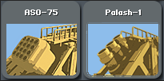

**「红外诱饵弹」ASO-75**: `m_oid=MDL_FLARES`

**「主动防御系统」Palash-1**: `m_oid=MDL_KAZ`

#### 诱饵弹参数

`m_weapon_load_amount=30 `   装填量

`m_weapon_load_time=99999`  装填时间

`m_weapon_rate=400`  发射速率

#### 主动防御系统参数

`m_weapon_load_amount=2`  装填量

`m_weapon_load_time=20` 装填时间

`m_weapon_rate=400`  发射速率

------

### 信息系统

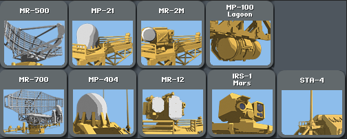

#### 主动雷达

**「大」MR-700**:  `m_oid=MDL_RADAR_01`

**「小」MR-500**:  `m_oid=MDL_RADAR_02`

##### 主动雷达参数

`m_mdl_radar=750` 探测距离

#### 被动雷达

**「大」MP-404**:  `m_oid=MDL_SPO_01`

**「小」MP-21**:  `m_oid=MDL_SPO_02`

##### 被动雷达参数

`m_mdl_elint=2`  1=750km探测距离，2=2×750km

#### 火控雷达

**「大」MR-12**:  `m_oid=MDL_FCR_01`

**「小」MR-2M**:  `m_oid=MDL_FCR_02`

##### 火控雷达参数

`m_mdl_radar=400`  探测距离，单位公里

`m_mdl_tracking=400`  跟踪距离，单位公里

`m_mdl_guiding=2`  火控通道，同时引导的拦截弹数量

#### 红外搜索跟踪系统

**IRS-1 Mars**: `m_oid=MDL_IRST_01`

##### 红外搜索跟踪系统参数

`m_mdl_irst=300` 红外探测距离，单位公里

####  干扰机

**MP-100 Lagoon**: `m_oid=MDL_JAMMER_01`

##### 干扰机参数

`m_mdl_jammer=4000`  干扰距离，单位km

#### 天线

**STA-4**:  `m_oid=MDL_ANTENNA_01`

------

### 着陆架

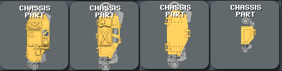

**「超大」**: `m_oid=MDL_LEG_04`

**「大」**: `m_oid=MDL_LEG_03`

**「中」**: `m_oid=MDL_LEG_02`

**「小」**: `m_oid=MDL_LEG_01`

#### 着陆架参数

`m_mdl_leg_force=1600` 着陆架承重，单位KN

------

### 火炮

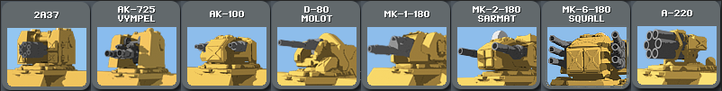

**「37毫米火炮」2A37**:  `m_oid=MDL_CANNON_30_6`

**「57毫米火炮」AK-725** :  `m_oid=MDL_CANNON_57_2`

**「100毫米火炮」AK-100** :  `m_oid=MDL_CANNON_100_2`

**「130毫米火炮」D-80** :  `m_oid=MDL_CANNON_130`

**「180毫米单管」MK-1-180** :  `m_oid=MDL_CANNON_180`

**「180毫米双管」MK-2-180** :  `m_oid=MDL_CANNON_180_2`

**「180毫米6管」MK-6-180**:   `m_oid=MDL_CANNON_305_2`

**「220毫米火箭弹」A-220**:  `m_oid=MDL_RSZO_220`

#### 火炮参数

`m_mdl_ammobox_need=8`  弹药盒需求

`m_mdl_rotation=1`  旋转速度，1=60°/秒

`m_weapon_priority=300`   供弹优先级

`m_weapon_caliber=25`  弹药种类

`m_weapon_load_amount=6`  装填完毕弹药数

`m_weapon_load_time=7`  装填时间，单位秒

`m_weapon_rate=180`  射速，单位发/分

------

### 导弹

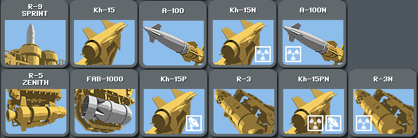

**「红外反舰导弹」 R-5 Zenith**:  `m_oid=MDL_MISSILE_01`

**「高速拦截导弹」R-9 Sprint**:  `m_oid=MDL_MISSILE_03`

**「高爆对地炸弹」FAB-1000**:  `m_oid=MDL_BOMB_01`

**「巡航导弹」Kh-15**:  `m_oid=MDL_NUKE_01_CONV`

**「反辐射导弹」Kh-15P**:  `m_oid=MDL_NUKE_02_CONV`

**「战术弹道导弹」A-100**:  `m_oid=MDL_NUKE_03_CONV`

**「战略弹道导弹」R-3**:  `m_oid=MDL_NUKE_04_CONV`

**「核巡航导弹」Kh-15N**:  `m_oid=MDL_NUKE_01`

**「核反辐射导弹」Kh-15PN**:  `m_oid=MDL_NUKE_02`

**「核战术弹道导弹」A-100N**:  `m_oid=MDL_NUKE_03`

**「核战略弹道导弹」R-3N**:  `m_oid=MDL_NUKE_04`

#### 导弹参数

`m_missile_explosive=4e+07`  爆炸伤害

`m_acceleration_time=2`  加速时间

`m_launched_speed=2300`  巡航速度

`m_launched_speed2=1200`  加速度

`m_missile_agility=4`  灵敏度

`m_launched_range=2000`  射程，单位公里

`m_launched_health=10`  血量

------

### 装甲

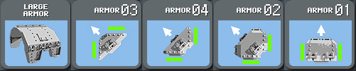

#### 大型装甲

**直装甲**:  `m_oid=MDL_ARMOR2X1_01`

#### 小型装甲

**直装甲**:  `m_oid=MDL_ARMOR1X1_01`

**90度转角装甲**  :`m_oid=MDL_ARMOR1X1_02`

**三角装甲外**: `m_oid=MDL_ARMOR1X1_03`

**三角装甲内**:  `m_oid=MDL_ARMOR1X1_04`

#### 装甲参数

装甲的血量参数需要在Parts.seria中的复制出详细信息内添加，如下：

```
m_children=15
{
#前略
m_oid=MDL_ARMOR1X1_01
m_health=6666
m_health_max=6666
#后略
}
```

`m_health=6666` 

`m_health_max=6666` 血量，两者需同时修改

如需修改自制部件的血量，需在上述教程[第五步](#修改部件信息，将部件导入Constructor.seria)修改m_oid时，添加上述代码。

------

### 结构

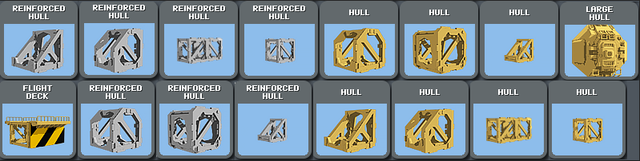

**飞行甲板**:  `m_oid=MDL_DECK_01`

**「大型结构」 Large Hull**:  `m_oid=MDL_FERMA4X4_01`

#### 1×1构件

**方**:  `m_oid=MDL_FERMA1X1_01`

**三角**:  `m_oid=MDL_FERMA1X1_04`

**加固方**:  `m_oid=MDL_HARD1X1_01`

**加固三角**:  `m_oid=MDL_HARD1X1_04`

#### 2×1构件

**长方**:  `m_oid=MDL_FERMA2X1_01`

**加固长方**:  `m_oid=MDL_HARD2X1_01`

#### 2×2构件

**正方**:  `m_oid=MDL_FERMA2X2_01`

**五边**:  `m_oid=MDL_FERMA2X2_02`

**六边**:  `m_oid=MDL_FERMA2X2_03`

**三角**:  `m_oid=MDL_FERMA2X2_04`

**加固正方**:  `m_oid=MDL_HARD2X2_01`

**加固五边**:  `m_oid=MDL_HARD2X2_02`

**加固六边**:  `m_oid=MDL_HARD2X2_03`

**加固三角**:  `m_oid=MDL_HARD2X2_04`

#### 结构参数

结构的血量参数在Parts.seria内，如下：

```
m_children=15
{
#前略
m_oid=MDL_ARMOR1X1_01
m_health=6666
m_health_max=6666
#后略
}
```

`m_health=6666` 

`m_health_max=6666` 血量，两者需同时修改

如需修改自制部件的血量，需在上述教程[第五步](#constructor-seria)修改m_oid时，添加上述代码。

### 其它参数

将自制舰船改为旗舰：

打开位于Ships内舰船文件，搜索舰船名称，在下面一行添加 `m_flagship=true`

