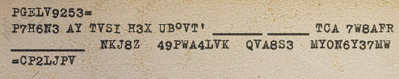
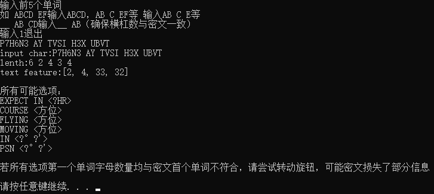
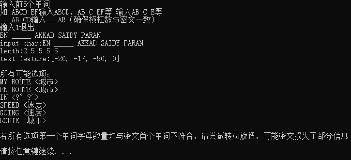
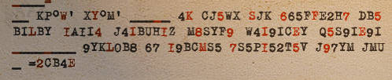
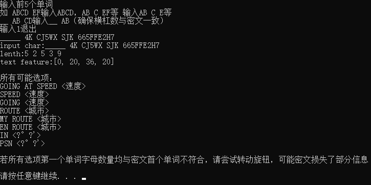

#                            暴力破解电报

**本文仅适用于英文原文电报，汉化后的电报无法使用下述方法破解！**

## 识别电报

### 1.商队电报组成

```
收信者=
位置/航向/速度/路线/预计到达时间（四个信息均有或其中部分信息）+搭载货物 + 其他信息(可能无)
=发信者
```

### 2.固定格式
蓝色部分为根据游戏内发信者实际情况存在变动的部分

#### 航行信息
Heading <font color=blue>NORTH NORTHEASE</font>    (航向)
Expect in <font color=blue>13HR</font> PSN  <font color=blue>20°31' 30°40'</font> speed <font color=blue>110</font>    (预计到达时间+位置+航向)
En route <font color=blue>AKKAD SAIDY PARAN ASHOD</font>  (路线)

#### 搭载货物 
格式基本固定：
Main cargo <font color=blue>URANIUM CONCENTRATE</font> 
Cargo <font color=blue>ELECTRIC EQUIPMENT</font>
<font color=blue>NO CARGO</font>
Carrying <font color=blue>ORE</font> 

#### 其他信息
格式较多：
escorted by cruiser  (护送情况:有/无护航)
Prepare repair dock
Prepare fuel
Urgent repair required on arrival  (需要维修或燃料)

Require on arrival <font color=blue>BRASS TUBE</font> wire whether you can supply 
urgently require <font color=blue>CABLE PN30</font> on arrival (需要特定物资)

Flight uneventful
All well
Regards  (问候)

## 破解电报的原理

那么，看完上面的固定格式，其实破解的办法也就呼之欲出了：利用电报内固定格式来破译密钥。
由于每一封电报都至少包括位置或航向等信息，使用位置信息的固定格式就能完成破解。

例如
P7H6N3 AY TVSI H3X...，观察发现电报格式内仅有`EXPECT IN <xxHR>`符合，即可锁定。
对于MOVING FLYING等具有相同长度的格式，则可以多此尝试即可。（其实也可以将程序写的更完善，根据加密的方式排除，但没必要，因为。。多试几次也不会死啦，懒得写。。）

## 破解程序的使用

使用说明在程序内已经较为详尽。

**请使用全大写输入**
**密文1与i，o与0较为相似，可调节旋钮避开这几个字符**

**有时电报会随旋钮调节，部分单词长度发生变化，请都测试一次**

如：


即输入 `P7H6N3 AY TVSI H3X UBVT`
（遇到°、'符号需要跳过，不过看到座标符号也不需要使用本程序了：座标前单词三个字母：PSN，两个：IN，8个字母：POSITION，直接带入翻译即可）


代入第一个测试成功。

------


即输入 `EN _____ AKKAD SAIDY PARAN` （此处使用已解密密文展示，密文类似）
（请注意，下划线数目请与密文数目保持一致，可通过旋转旋钮高亮部分下划线，更容易数清楚）



代入测试，第二个成功。

------




本密文不同于之前，存在大量信息缺失，但是注意到该段密文极长，故一定同时包含了多个发信者的航行信息，所以使用后部分密文进行解密，输入 `_____ 4K CJ5WX SJK 665FFE2H7` 



测试第一个成功。

此段密文还有另一无需本解密软件的解密方法：
根据电报信号强度和位置信息可大致猜测文中的座标所在城市（座标一定在城市），进而破译。（这也是本解密软件未出现前本人使用的办法。)

------

## 常见问题

1. 软件报错

   本软件鲁棒性较差，未作输入检验，请不要测试软件对奇怪输入的反应Q_Q

2. 所有可能选项测试都无法破解

   1. 输入错误：i与1，o与0混淆

      调节旋钮避开上述字符

   2. 电报长度错误：部分电报存在单词长度随旋钮变化变化的现象

      若存在电报长度变化，请尝试变化前后的两种模式。通常随旋钮变化稳定性较强的模式为正确格式！

   3. 其他错误

      我想不出了，遇到直接群里@我捏。

**本软件及方法还在初始阶段，可能存在较多问题。制作比较粗糙请谅解**
